# Practical Assignment 5:
# Gephi and Social Network Basic Analysis
##### Behavior Dynamics in Social Networks 2016

**PS.:** Excited about Github? You can see the project for this assignment at https://github.com/ericinlinux/BDiSN_Assignment_5

This assignment is divided in 3 parts. The idea is to teach how to work with Gephi, a Social Analysis software, and also to do some data mining in Twitter.

## Part A: Introduction to Gephi

#### A.1. Set up and introduction to Gephi

This part is dedicated to make yourself ackquainted to the Gephi and its environment. You are going to install Gephi and take a look on the tutorial before doing the activities. Then you are going to follow the steps below.

The entire data set is found together with the assignment. 

##### Gephi Download

* [Gephi 0.9.2 - https://gephi.org/users/download/](https://gephi.org/users/download/)
* **Required:** [Java Runtime Environment - http://www.java.com/nl/download/index.jsp](http://www.java.com/nl/download/index.jsp)
* **Remark:** update your Gephi when requested.

##### Gephi Tutorials

* [Quick Start Tutorial - https://gephi.org/users/quick-start/](https://gephi.org/users/quick-start/)
* [Optional - https://gephi.org/users/tutorial-layouts/](https://gephi.org/users/tutorial-layouts/)
* [Optional - https://gephi.org/users/tutorial-visualization/](https://gephi.org/users/tutorial-visualization/)

When you open Gephi it should be possible to see this data sets:

* Les Miserables.gexf
* Java.gexf
* Power Grid.gml

Before we begin with the practical assignment below, it is necessary become acquainted with the Gephi environment. This leads us to step 1.

**Step 1:** Go through the quick start tutorial: [https://gephi.org/users/quick-start/](https://gephi.org/users/quick-start/)

The network for this tutorial ‘*LesMiserables.gefx*’ can also be downloaded from Canvas.

----

#### A.2. The dining-table partners Network

Now we are going to look at the network we will use for this practical assignment.

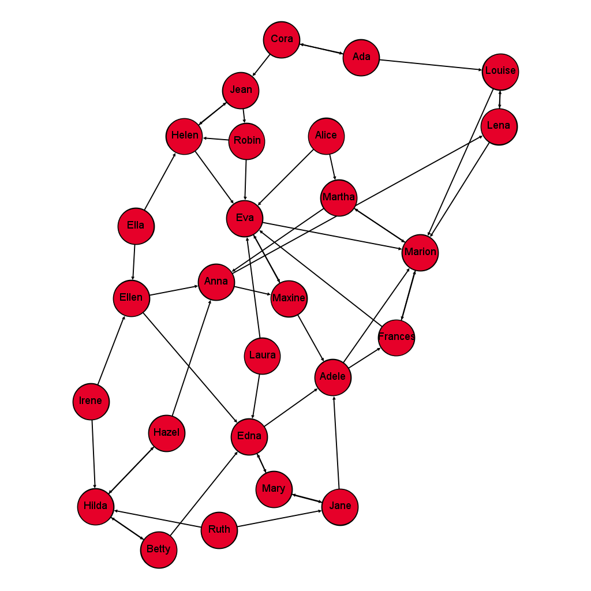
*Fig 1:*  Girls’ school dormitory dining-table partners, 1st and 2nd choices (Moreno, The sociometry reader, 1960).

<!--

*Fig 1:*  Girls’ school dormitory dining-table partners, 1st and 2nd choices (Moreno, The sociometry reader, 1960).

-->

The network in figure 1 shows an example of sociometric research. It depicts the choices of twenty-six girls living in one *cottage* (dormitory) at a New York state training school. The girls were asked to choose the girls they liked best as their dining-table partners. First and second choices are selected only.

In this sociogram, each girl in the dormitory is represented by a circle. For the sake of identification, the girls’ names are written next to the circles. Each arc (arrow) represents a choice. The girl who chooses a peer as a dining-table companion sends an arc toward her. Irene (in the bottom right of the figure), for instance, chose Hilda as her favorite dining-table partner and Ellen as her second choice, as indicated by the numbers labeling each arrow. (de Nooy, Mrvar, Batagelj, & Granovetter, 2012).

Now that you know the concepts nodes (or vertices, sites, actors), degrees and lines (or edges, arces, links, bonds, ties, relations), we will look at some basic analysis and representation options for the network.

**Step 2:** Download and open the dataset file ‘DiningTablePartners.gephi’ in Gephi. Open the file as a directed network when asked.

As you can see the graphical representation of the network needs some work. First, we want to change the layout of the nodes, and then we want to add labels to the nodes.

**Step 3:** Choose the ‘Force Atlas’ layout algorithm under the layout tab and run it until the network has become stable in its new form.

**Step 4:** Click on the ‘Show node labels’ option at the bottom of the screen and adjust the size with the ‘Font size scale’ so that it looks in proportion.

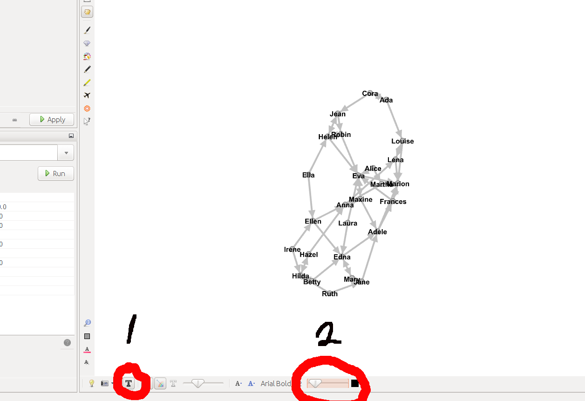
*Fig 2:*  Tools to show labels and change their size.
-----

Because this is a directed graph, we can calculate the Degree, In-Degree and Out-Degree values.

**Step 5:** Run the ‘Average degree’ option under the ‘Statistics’ tab.

**Remark:** After each initiated calculation, these results can also be found and edited in the ‘Data Laboratory’.

##### Question 1:

a. Give the average degree value and comment why this is a logical value?
b. Given the In-Degree distribution, how many have the highest value, and what is this value?
c. What does the In-Degree value mean in the context of this network?
d. Who is the most isolated person in the group? How did you define isolation using the degrees?
e. If we want to help the girls to change their routine and be more active, we need to know who are the most important nodes in the network, and try to make sure that these people are being affected by some sort of health lifestyle program. Who would you pick from this group? Explain the reasons and argue in favor of your choice(s).

-----

Now we want to give the nodes different sizes corresponding to their In-Degree value.

**Step 6:** Under the ‘Ranking’ tab, under ‘Nodes’, select In-Degree as input. Next the ‘Nodes’ tab you can select four ways to display the input in the network, which are by color, by size/weight, by label color, and by label size. Select the size/weight option. For minimum size we select 2 and for maximum size we choose 10. Then click ‘Apply’.

##### Question 2:
a. Does this representation helps you to find who are the most isolated or popular nodes?
b. Which other metrics would you use to define the position of a person in a network?

----

Now, we want to know how many, and which nodes, clusters of nodes, or components, in the directed network are **strongly connected**. A directed network is strongly connected if there is a path from each node in the graph to every other node, specifically a path in each direction, a path from *a* to *b* and a path from *b* to *a*. Identifying strongly connected components gives an idea about how information might flow. E.g. if someone had some piece of gossip, how would this information spread? For calculating the connected components, Gephi uses a depth-first search algorithm written by Robert Tarjan (1972).

**Step 7:** Run the ‘Connected Components’ option under the ‘Statistics’ tab.

##### Question 3:
* How many strongly connected components (or subgraphs) are found?

The connected components can be graphically represented in the network, which will be our next step.

**Step 8:** Under the ‘Partition’ tab, choose the ‘Nodes’ option. Select the refresh option so the connected component analysis becomes available in the selection menu next to it. Select the ‘Strongly-Connected ID’ from the selection menu. Now click ‘apply’.

**Remark:** By right-clicking near the colors of the different components, it is possible to randomize colors, if you want to change them. Also you can click on each color to select specific colors for each component.

Now we would like to introduce the notion of centrality of nodes within a network. There are various types of measures of the centrality of a node that determines the relative importance of a node in the network. In the current network the centrality of the node would represent the popularity or influentially of the girl within the group. Various methods of calculating the centrality include:

* **Degree centrality:** where the number of edges a node has determines the centrality value;
* **Closeness centrality:** where the sum of the shortest paths of node s to all other nodes
determines the closeness centrality value;
* **Betweenness centrality:** where vertices that have a high probability to occur on a randomly chosen shortest path between two randomly chosen nodes have a high betweenness centrality; and
* **Eigenvector centrality:** where relative scores are assigned to all nodes in the network based on the concept that connections to high-scoring nodes contribute more to the score of the specific node than equal connections to low-scoring nodes.

For this assignment we will be using the betweenness centrality measure for determining the sizes of the nodes. This leads us to the next step.

**Step 9:** Run the ‘Avg. Path Length’ option under the ‘Statistics’ tab. When asked choose the ‘Directed’ option and leave the ‘Normalize Centralities in [0,1]’ option unchecked. Within this calculation the Betweenness Centrality, Closeness Centrality and the Eccentricity are calculated.

##### Question 4:
* Who has the highest betweenness centrality value, and what is this value?

**Step 10:** Under the ‘Ranking’ tab, choose ‘Nodes’ and choose the size/weight option. Choose
‘Betweenness Centrality’ from the selection menu. After setting the minimum size to 2 and the
maximum size to 10, click ‘Apply’.

**Remark:** Earlier we used the In-Degree values to determine the size of the nodes, and now we let the Betweenness Centrality value to determine the nodes. Mind the changes of the size of some of the nodes, that became bigger or smaller after step 9. If you did not see the changes, you can reselect In-Degree and click ‘Apply’ again, to see them. Do not forget to select Betweenness Centrality as rank afterwards.

##### Question 5:
* Can you explain the changes in size of the nodes between the In-Degree measure and the Betweenness Centrality measure?

Finally, we want to output the network in PNG format. If you want to learn more about layout and visualization options, you can look at https://gephi.org/users/tutorial-layouts/ and
https://gephi.org/users/tutorial-visualization/.

**Step 11:** Click on the ‘Preview’ tab at the top of the screen. Choose the ‘Show Labels option’ under ‘Node Labels’. Under ‘Node Labels’ you can also adjust the font, and font-size. Unclick the proportional size, to unrelate the size of the nodes with size of the labels. Click ‘export: SVG/PDF/PNG’, give the output file a name and choose PNG as output format. Copy the PNG file in your document where you wrote down the answers to the questions.
Probably your output will look similar to figure 2.

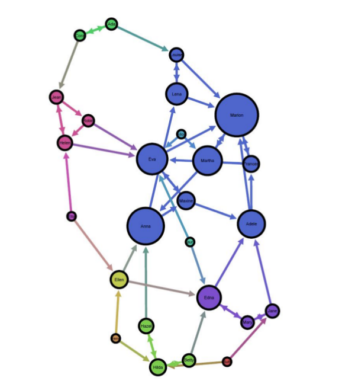
*Fig 2:*  Expected graph after the previous steps

## Part B: Facebook network

For this second part we will be doing similar calculations as in assignment 1. For specific calculation steps you can look at the step descriptions in part A.

**Step 1:** Download and open the dataset file ‘ExampleFacebook.gml’ in Gephi. Open the file as a directed network when asked.

##### Question 1:
1. How many nodes are in this network?
2. How many relations are in this network?
3. What is the average degree?
4. Which person has the most connections / degrees?
5. Who is the most influential person in the network according to Betweenness centrality calculation?

**Step 2:** Turn on the labels for each node and adjust the size of the labels to your liking.

**Step 3:** Apply a node ranking calculation that calculates the size for each node related to the Betweenness centrality for each node.

Now we introduce a method which extracts the community structure of large networks. It is a heuristic method based on modularity optimization. For more information about this method, see Blondel, Guillaume, Lambiotte & Leferbvre (2008).

**Step 4:** Click on the calculation option ‘Modularity’ under ‘Statistics’, with the options ‘Randomize’ on and with resolution ‘1.0’.

##### Question 2:
1. How many communities are in this network?
2. How big is the largest community (how many nodes)?

**Step 5:** Apply a node partition calculation that attributes the color for each community to each node.

**Step 6:** Play with the ‘Force atlas’ layout algorithm until you find a suitable graphical layout for the network. Also play with the ‘attraction distribution’ and ‘adjust by sizes’ options.

**Step 7:** Output the network to PNG format when you are pleased with the graphical representation of the network. Copy the PNG file in your document where you wrote down the answers to the questions.

**Step 8:** Save the document with all our answers and graphical output and name it as follows: *bd5-lastname1-lastname2.*

Possibly your output will look similar to figure 3.

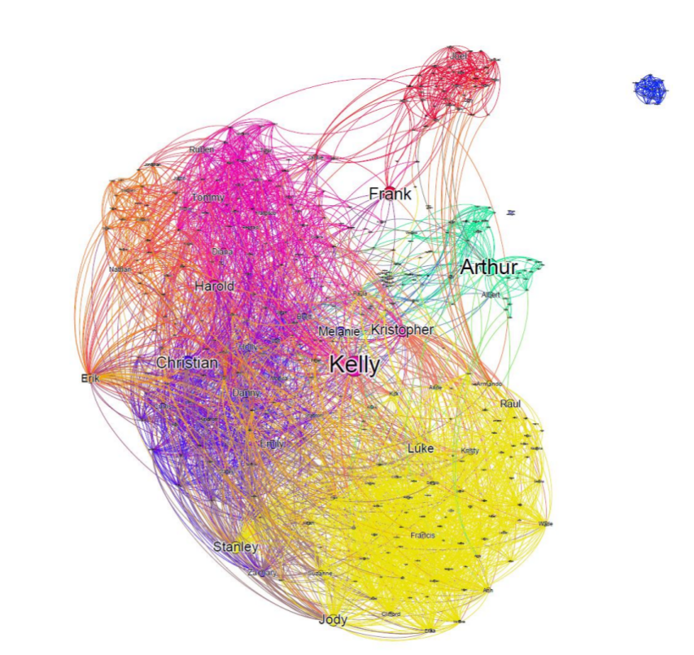
*Fig 3:*  Facebook network

## Part C: Gathering data from social media
This part of the assignment should be done using the Jupyter interface, through Anaconda development software. This software will allow you to use Python codes in a web interface, helping you to visualize your results and replicate others' easily.

**Step 1:** Download the Anaconda from the website https://www.continuum.io/downloads. Hopefully it will show the platform of your PC.

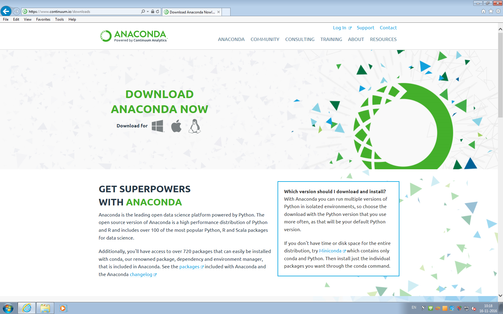

The next screens are for Windows platform (from the lab where you are seated).

**Step 2:** after download, click at the Run button on the bottom of your web brower.

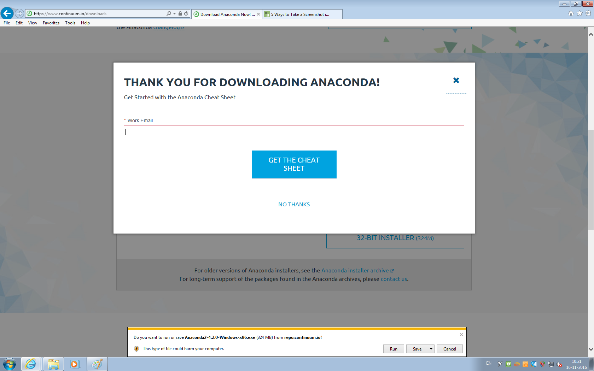

**Step 3:** Next-Next-Next

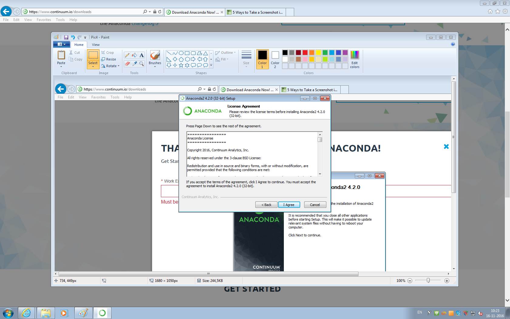
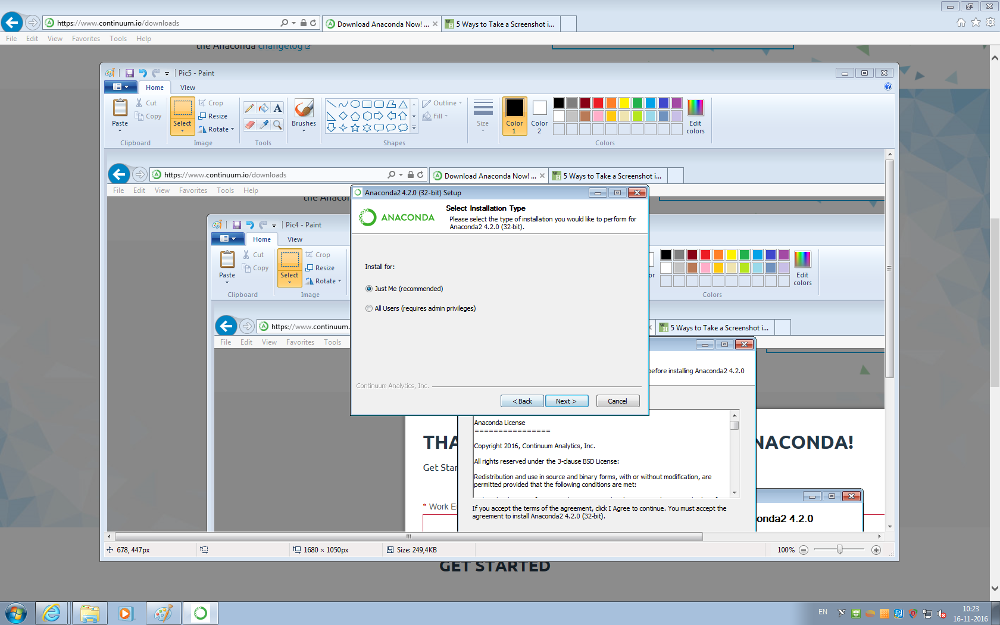
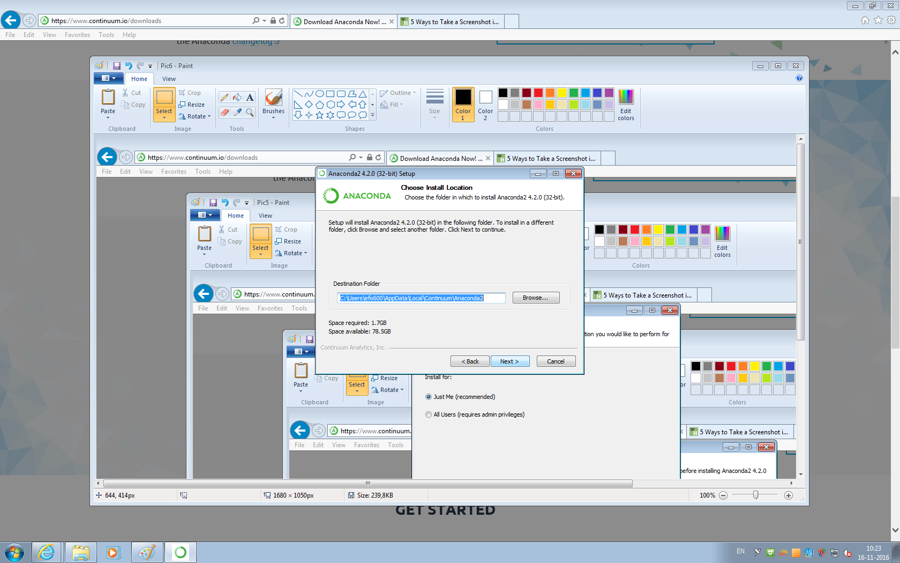

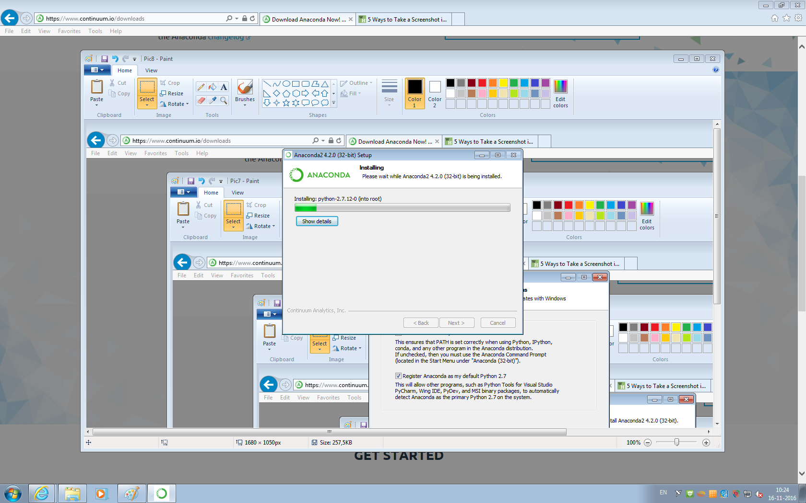

**Step 4:** if everything went fine, click Finish and unckeck the box (unless you are interested on learning more about Anaconda Cloud)

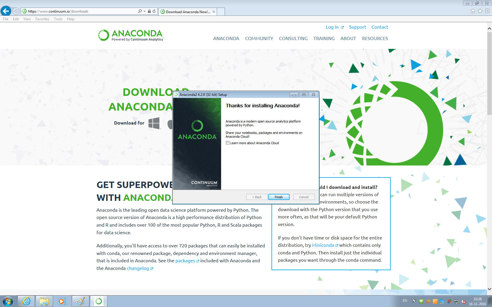

**Step 5:** open the **Anaconda Navigator** software.

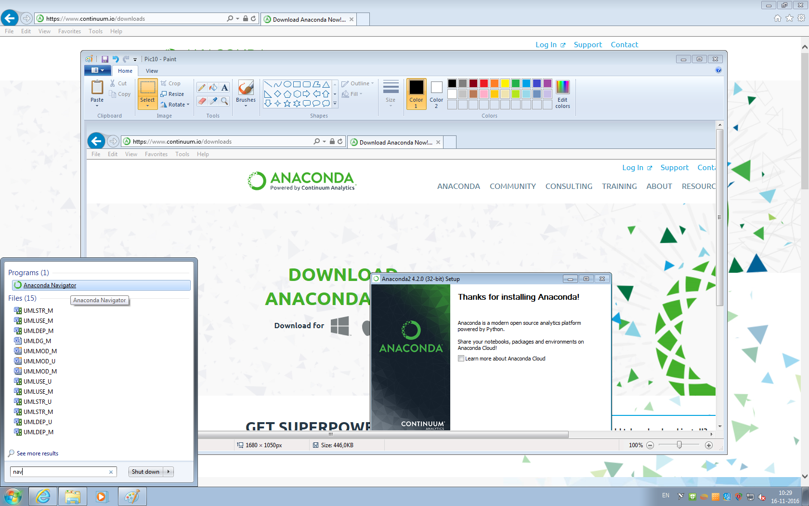

**Step 6:** The Anaconda interface might look like the figure below. Here you have the notebook platform, and you can Lauch it.

**Step 7:** after a terminal (or console) shows some stuff happening (don't close it!), your web browser may show the following screen, with your files explorer.

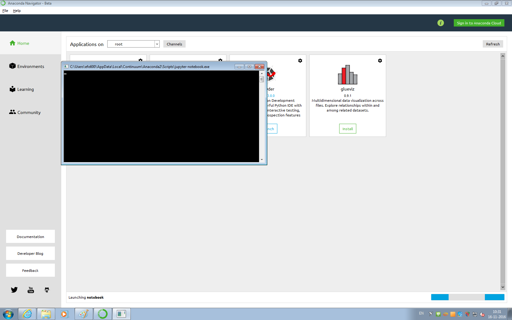

Good! You are ready to start. You can create a new Notebook, but we are gonna use my own notebook. So go to BB and download the file Part_C.zip and download it at your computer. There you can find the file Assignment5_Part_C.ipynb.

**Step 8:** open the ipynb file using Jupyter interface, and have fun!

## Belangrijk!

At the end of the activities with the notebook, you should save your own notebook as PDF and send it together with the other files from the previous parts.

## References

* Blondel, V. Guillaume, J., Lambiotte, R., Lefebvre, E. Fast unfolding of communities in large networks, in Journal of Statistical Mechanics: Theory and Experiment 2008 (10), P1000
* De Nooy, W., Mrvar, A., Batagelj, V., & Granovetter, M. (Series Editor), Exploratory Social
Network Analysis with Pajek (Structural Analysis in the Social Sciences), Cambridge University Press 2005 (ISBN 0-521-60262-9). ESNA in Japanese, TDU, 2010
* Gephi datasets from: Adamic, L. Social Network Analysis, University of Michigan.
* Moreno, The sociometry reader, 1960
* Tarjan, R., Depth-First Search and Linear Graph Algorithms, in SIAM Journal on Computing 1 (2): 146–160 (1972)
